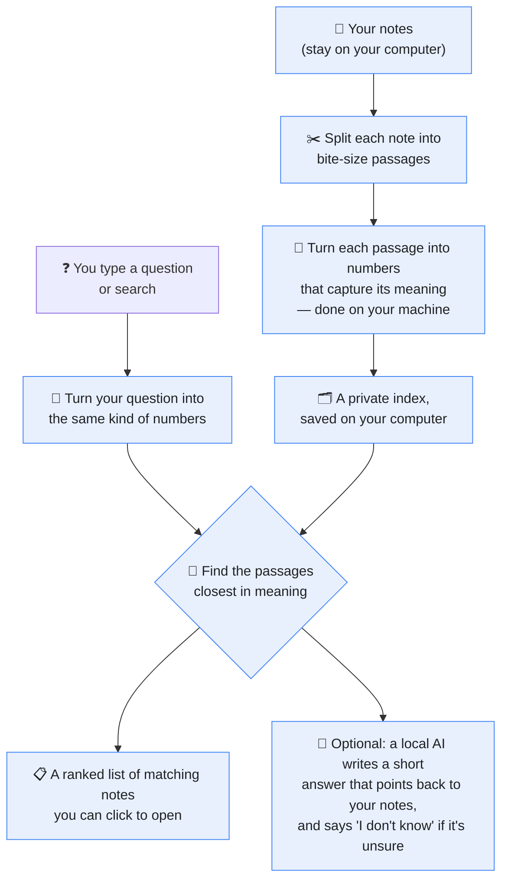

# VaultSleuth

VaultSleuth is a local-first Obsidian plugin that adds semantic search and a
vault-grounded chat panel across an entire vault. Indexing, search, and the
embedding model all run fully on-device — after a one-time embedding-model
download there are no network calls by default, and the plugin never writes to
your notes. Chat answers can be generated by a local model (Ollama / LM Studio)
or, opt-in, a hosted one. It is built as a practical learning application that
explores on-device retrieval-augmented search inside a desktop editor. For
example, a note titled "tapering off caffeine" becomes findable by searching
"reduce coffee", which Obsidian's lexical search cannot do.

## How it works (in plain terms)

Think of VaultSleuth as a very patient **librarian** who has quietly read every note
you've ever written. Instead of remembering exact words, the librarian remembers
what each note _means_. So when you ask for "how to cut back on coffee," they walk
straight to your note about "tapering off caffeine" — even though it doesn't use
any of the same words. Everything the librarian does happens **on your own
computer**: your notes never leave the building.



**The pieces, in everyday words:**

- **Your notes** — the Markdown files in your vault. VaultSleuth only ever _reads_
  them.
- **Splitter** — long notes are cut into small passages so matches can be precise.
- **Meaning-maker (the embedding model)** — a small AI that runs on your computer
  and turns text into a list of numbers representing its meaning. Similar meaning →
  similar numbers.
- **The index** — a private filing cabinet of those numbers, stored in the
  plugin's own folder.
- **Search** — your question gets the same number treatment, and VaultSleuth finds
  the passages whose numbers are closest.
- **Chat (optional)** — if you connect a local AI (Ollama or LM Studio), it reads
  the matched passages and writes a short, cited answer. By default this step is
  off and you just get the matching passages.

## Architecture

```
vault events (create/modify/delete/rename)
        │  (debounced, content-hash diff)
        ▼
   chunk (heading-aware, ~512 tokens, 64 overlap)
        │
        ▼
   embed  ──►  transformers.js on-device (ONNX Runtime, WASM/CPU), in batches
        │
        ▼
   store  ──►  Float32 vectors (exact cosine; HNSW above a threshold)
        │      + BM25 lexical index
        ▼
   search / chat  ──►  hybrid rank (α·cosine + (1−α)·bm25)  ──►  cited answer
```

The codebase is split into two layers with a strict rule:

- **`src/core/`** — pure retrieval logic (chunker, embedder, vector store, BM25,
  hybrid ranker, chat/citation engine). It imports **nothing from `obsidian`**,
  so it compiles and unit-tests in plain Node. This is what makes the retrieval
  behaviour testable and the eval reproducible.
- **`src/obsidian/`** — thin glue to the Obsidian API (the sidebar view, the
  settings tab, the vault-event wiring, and a `requestUrl`-based HTTP client for
  local LLM backends). It is excluded from unit tests.

Embedding runs on-device via transformers.js, batched and deferred to after the
workspace is ready (and debounced on edits) so it stays off the interactive path.

## Setup

Requirements: **Node.js 22 LTS** and npm.

```bash
npm ci          # install pinned dependencies
npm run build   # bundle src/main.ts → main.js
```

To test it in a vault, copy `main.js`, `manifest.json`, and `styles.css` into
`<your-vault>/.obsidian/plugins/vaultsleuth/`, then enable VaultSleuth in
Obsidian's Community Plugins settings. On first index the embedding model
(~33 MB) is downloaded once and cached on disk; everything after that is offline.

## Demo vault

The repo ships a ready-made vault at [`demo-vault/`](demo-vault/) so you can try
VaultSleuth without using your own notes.

**What it contains:** 1,000 Markdown notes, one per scientific abstract from the
[BeIR/SciFact](https://github.com/allenai/scifact) corpus — peer-reviewed
biomedical and life-sciences research (genetics, immunology, oncology, cell
biology, neuroscience, …). Each note has YAML frontmatter (`id`, `title`,
`source`) and the abstract text under a heading, e.g.:

```markdown
---
id: "12885341"
title: "A C-Type Lectin Collaborates with a CD45 Phosphatase Homolog to Facilitate West Nile Virus Infection of Mosquitoes"
source: "BeIR/SciFact"
---

# A C-Type Lectin Collaborates with a CD45 Phosphatase Homolog …

<abstract text>
```

**To use it:** open `demo-vault/` as a vault in Obsidian (Open another vault →
Open folder as vault) and install the plugin into
`demo-vault/.obsidian/plugins/vaultsleuth/` as in Setup. Wait for the status bar to
reach `indexed (N chunks)`.

**Sample searches** (Search tab — these have matching notes in the vault):

- `ALDH1 expression and breast cancer outcomes`
- `0-dimensional biomaterials inductive properties`
- `do hematopoietic stem cells segregate chromosomes randomly`
- `loss of TET protein function and myeloid cancers`

**Sample chat questions** (Chat tab — needs a generation model; see
Configuration):

- "Is ALDH1 expression associated with breast cancer prognosis?"
- "What role does DMRT1 play in sex determination?"
- "Can blocking the TDP-43 interaction with complex I proteins reduce neuronal
  loss?"
- "Summarize what the notes say about TET proteins and cancer."

Answers cite the source notes as `[[links]]`, and the **Context used** chips under
each reply show exactly which abstracts were retrieved. Because the corpus is
scientific, phrasing questions in its terms (gene names, conditions) gives the
best matches.

## Configuration

Every setting has a default, so a fresh install runs fully offline with no setup.

| Setting                                           | Default                                  | Purpose                                                    |
| ------------------------------------------------- | ---------------------------------------- | ---------------------------------------------------------- |
| `embeddingModel`                                  | `Xenova/bge-small-en-v1.5`               | On-device embedding model (also `Xenova/all-MiniLM-L6-v2`) |
| `chunkTokens` / `chunkOverlap`                    | `512` / `64`                             | Chunk size and overlap (approx. tokens)                    |
| `hybridAlpha`                                     | `0.6`                                    | Semantic vs lexical blend (1.0 = semantic only)            |
| `hnswThreshold`                                   | `20000`                                  | Chunk count above which HNSW replaces exact cosine         |
| `generationBackend`                               | `none`                                   | `none` \| `ollama` \| `lmstudio` \| `hosted`               |
| `ollamaEndpoint` / `ollamaModel`                  | `http://localhost:11434` / `llama3.1:8b` | Local generation (Ollama)                                  |
| `lmstudioEndpoint` / `lmstudioModel`              | `http://localhost:1234/v1` / _(picked)_  | Local generation (LM Studio, OpenAI-compatible)            |
| `hostedEndpoint` / `hostedModel` / `hostedApiKey` | empty                                    | Opt-in hosted generation only                              |
| `localModelPath`                                  | empty                                    | Advanced: load the model from a vault folder (offline)     |
| `excludedFolders`                                 | `[]`                                     | Vault folders to skip when indexing                        |

### Advanced: fully offline (local model)

By default the embedding model is downloaded once (~33 MB) and cached. For an
air-gapped install you can instead place the model files in your vault and point
the plugin at them — nothing is then downloaded.

1. Obtain the model files for your chosen model (e.g. from
   [`Xenova/bge-small-en-v1.5`](https://huggingface.co/Xenova/bge-small-en-v1.5)),
   or copy them out of the transformers.js cache after one normal online run.
2. Place them in a vault folder laid out as `<folder>/<model id>/…`, for example:

   ```
   models/Xenova/bge-small-en-v1.5/config.json
   models/Xenova/bge-small-en-v1.5/tokenizer.json
   models/Xenova/bge-small-en-v1.5/tokenizer_config.json
   models/Xenova/bge-small-en-v1.5/onnx/model_quantized.onnx
   ```

3. Set **Local model folder** in settings to that folder (`models` above), then
   run **Re-index vault**. The model now loads from disk with no network access.

> Experimental: model loading is verified against the default layout above; if
> embedding fails after setting it, clear the field to fall back to the download.

## Usage

- **Index** — indexing starts automatically when the plugin loads. Progress is
  shown in the status bar; edits re-index incrementally (only changed chunks are
  re-embedded). Use the command **VaultSleuth: Re-index vault** to rebuild.
- **Search & Chat** — open the panel from the ribbon or the command palette
  (**VaultSleuth: Open semantic search** / **Open chat**). One view with a
  **Search ⇄ Chat** toggle sharing a single input box:
  - **Search** gives ranked results with a score, a snippet, and actions to open
    in a split, insert a link, or copy a citation. It works with any backend
    (it never needs an LLM).
  - **Chat** is a multi-turn conversation grounded in your vault: each message
    runs a fresh hybrid retrieval, prior turns are threaded into a
    prompt-injection-safe prompt, and replies carry `[[note]]` citations. It
    needs a generation model, so the **Chat tab stays disabled until a usable
    backend is configured** — not just any non-`none` choice, but one with the
    fields it actually needs (a `hosted` backend, for instance, needs an endpoint,
    a model, and an API key). Pick a local (`ollama` or `lmstudio`) or `hosted`
    backend in settings to enable it; the model picker lists the models your
    server has available. When the notes don't cover a question the model answers
    from general knowledge, clearly flagged. **New chat** clears the conversation.
- **Index management** — re-index and view stats from the command palette and
  status bar.
- **Evaluate** — run `npm run eval` to reproduce the retrieval-quality numbers
  below. It indexes the committed demo vault headlessly and writes a metrics
  JSON to `eval/results/`.

## Results

Measured by `npm run eval` over the committed demo vault (1,000 SciFact notes →
1,010 chunks; 300 SciFact test queries; `α = 0.6`) with the default
`Xenova/bge-small-en-v1.5` model. Queries are embedded with the model's
recommended instruction prefix (BGE is an asymmetric retriever); passages are
not.

| Ranking          | nDCG@10 | recall@10 |
| ---------------- | ------- | --------- |
| Semantic         | 0.8361  | 0.9243    |
| Lexical (BM25)   | 0.7784  | 0.8597    |
| Hybrid (α = 0.6) | 0.8147  | 0.8986    |

Answer-grounding sanity check (WikiQA slice, 150 questions): the question's
nearest candidate sentence is a correct answer 58.0% of the time (accuracy@1),
with MRR 0.730.

**Honest verdict.** Hybrid beats pure lexical on both nDCG@10 (0.8147 vs 0.7784)
and recall@10 (0.8986 vs 0.8597). On this corpus, however, **pure semantic
ranking is the strongest** — SciFact is a scientific claim-verification task
where meaning matching dominates and the lexical signal adds some noise at the
default blend. The default `α = 0.6` is kept as a general-purpose setting that is
robust across vaults rather than tuned to this benchmark; raising `α` favours
SciFact specifically. These numbers were not tuned against the qrels.

**A note on refusal.** With the offline backend, chat refuses when the best
retrieved chunk falls below a per-model cosine floor. Dense embeddings are
anisotropic — even
unrelated text has a non-trivial baseline cosine — so the floor is calibrated per
model (0.5 for BGE) and the query instruction prefix is what cleanly separates
genuine queries from out-of-domain noise. The floor is deliberately biased toward
catching noise, so an occasional weakly-matching real question is declined rather
than answered from thin context.

## Privacy

- **Offline by default.** The only network access in the default configuration
  (`generationBackend: none`) is a **one-time download of the embedding-model
  weights** (~33 MB of data, not code), fetched from the Hugging Face CDN by
  transformers.js on first index and cached on disk. After that, indexing and
  search make **zero network calls** and run entirely on-device; chat is disabled
  until you choose a model.
- **Inference runtime is inlined into the plugin.** The ONNX Runtime WebAssembly
  engine (CPU build) is compiled **into `main.js` itself** and handed to the
  runtime as bytes — it is **never fetched from a CDN**, so no executable code is
  downloaded at runtime. (This is also why `main.js` is ~18 MB.)
- **Pinned model weights.** Each embedding model is loaded at an exact Hugging
  Face commit (`revision`), so the download is reproducible and a silently
  re-uploaded model — different weights, quantization, or a malicious ONNX —
  cannot change results out from under you.
- **Read-only over your vault.** The plugin only ever writes to its own
  `.obsidian/plugins/vaultsleuth/` data folder (the vector blob and its sidecar).
  It never modifies your notes.
- **Opt-in network paths.** `ollama` and `lmstudio` send retrieved chunks to a
  local server (localhost, on-device); `hosted` sends retrieved chunks to a
  user-configured endpoint with a user-supplied key. In all cases **only the
  retrieved chunks are sent — never the whole vault or the index**.
- **Key-sync caveat.** A hosted API key is stored in the plugin's settings. If
  you sync your `.obsidian` folder across devices, that key syncs with it; treat
  it accordingly.

## Limitations

- **Desktop-only.** `isDesktopOnly` is set; mobile is out of scope for this
  build.
- **Vault-size ceiling.** Vectors are held in memory. Exact cosine is used up to
  `hnswThreshold` chunks and HNSW above it; if the WASM HNSW module fails to
  load, the store falls back to exact cosine, which is slower on very large
  vaults. The practical target is single-user vaults up to roughly tens of
  thousands of notes.
- **Demo-vault and eval provenance.** The committed `demo-vault/` notes are
  derived from the **BeIR/SciFact** corpus (one note per abstract; license
  CC BY-NC 2.0 per the SciFact dataset card). The answer-grounding slice in
  `eval/wikiqa_slice.jsonl` is derived from **WikiQA** (Microsoft Research Data
  License per the WikiQA dataset card). `scripts/build_demo_vault.ts` documents
  exactly how these assets were generated; its output is committed, so a clean
  clone needs no network to build, test, or run.

## License

MIT.
